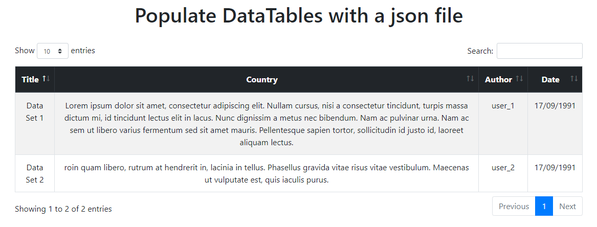
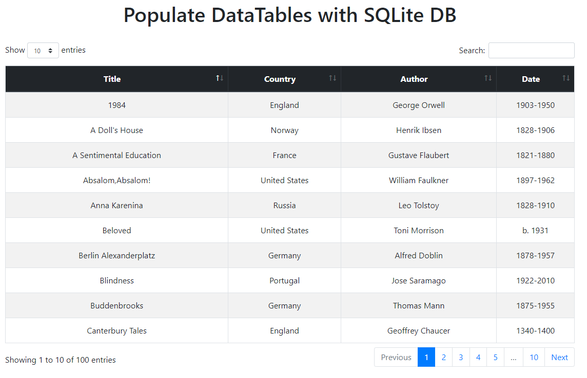
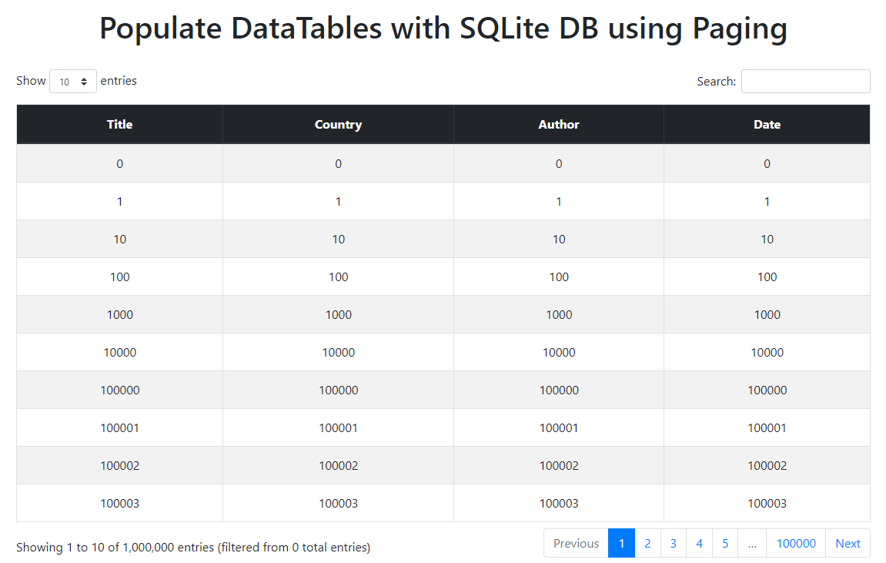

# How to populate DataTables using a Golang Web server

In this repository I'm going to explain how to populate DataTables using a Golang Web server and using different resources or ways such as: `json file`, `sqlite db`, `sqlite db with server-side processing` ...

This is the result of some research and a lot of Pick and Go

## Table of Content

+ [Dependencies](#dependencies)
+ [First Approach - JSON File](#json-file)
+ [Second Approach - Database without paging](#database-without-paging)
+ [Third Approach - Database with paging](#database-with-paging)
+ [Testing](#testing)
+ [References](#references)

## Dependencies

```bash
"github.com/op/go-logging"
"github.com/mattn/go-sqlite3"
```

## JSON File

For this approach we need a json file with the following structure:

```json
[
    {
        "Title": "Data Set 1",
        "Country": "1",
        "Date": "1",
        "Author": "1"
      },
      ...
]
```



## Database without paging

This second approach is useful when we are working with databases with about less than 30.000 rows.

It's simple and easy to setup, we only need to obtain the data from the database and then, send it in JSON format to the DataTable.



## Database with paging

For this approach I'm going to use SQLite. The reason is because I didn't find anything interesting of how to populate a DataTable using paging with SQLite and Golang. All the stuff that I found on the net were using PHP + MySQL or PostgreSQL.

If we need paging, it's because we are going to work with large amount of data. In order to achieve the best performance possible, we need to setup the database with some parameters.

Also, as the search is going to be on Server side, we are going to use indexes in the database to improve the speed.

```golang
//Connection Strings
db.SetMaxOpenConns(1)
db.Exec("PRAGMA journal_mode=MEMORY;")
db.Exec("PRAGMA _synchronous=OFF;")
```



## Testing

I have written 2 little programs under `test/Books` and `tests/LargeDB` for testing purposes. The first of them generates a .db file with the `Top 100 books of all time`, the second one generates a `.db file with 1.000.000 entries`.

```golang
//Add 1.000.000 entries to the DB
for i := 0; i < 1000000; i++ {
    data := strconv.Itoa(i)
    statement.Exec(data, data, data, data)
    }
```

## References

[SQLite documenation](https://www.sqlite.org/cvstrac/wiki)  
[DataTables documentation](https://www.datatables.net/manual/server-side)
